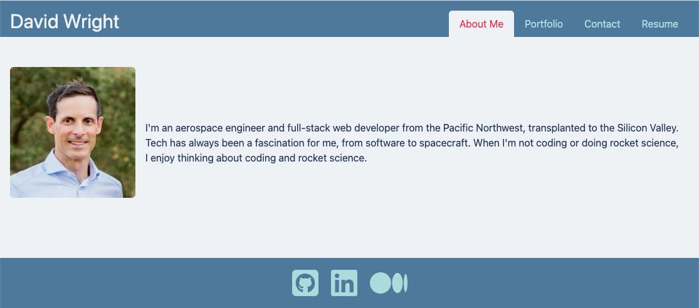
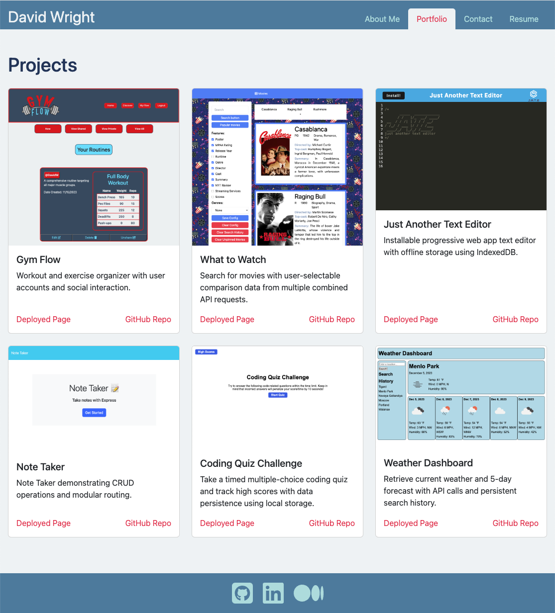
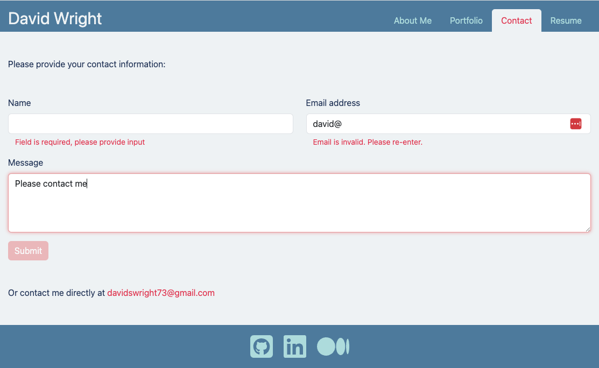
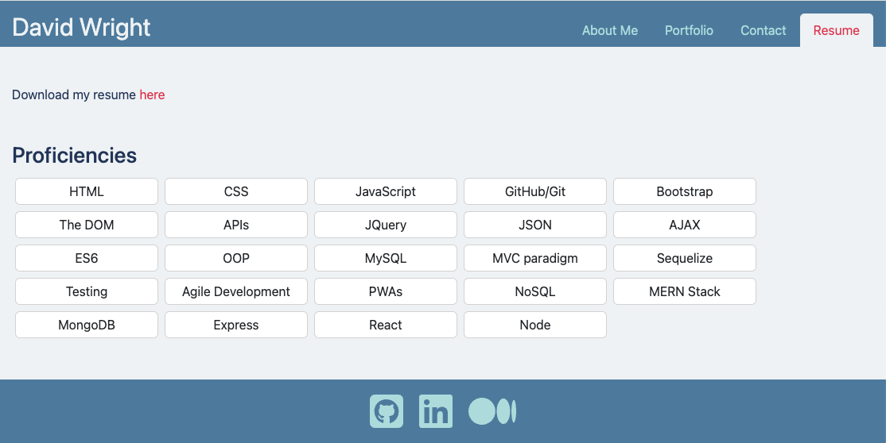

# React Portfolio

## Description 

For this project I wanted to use [React](https://react.dev/) to refactor a very simple application portfolio I had previously built. The original portfolio was essentially used only as a wireframe, as this project had to be built in an entirely different manner with React pages and components, including client-side routing using *react-router-dom*.

I had more opportunities to solidify my understanding of [Bootstrap](https://getbootstrap.com/) for styling and page components. I also used [Vite](https://vitejs.dev/) for the development environment as well as to optimize and bundle my application for deployment.

Various complications like form validation and repeating elements using React components provided additional valuable learning experiences.

This project has been deployed on [Heroku](https://www.heroku.com/) and can be found [here](https://react-portfolio-david-wright-fb25180d6958.herokuapp.com/).


## Installation

To install this application locally for development purposes, copy the files and folders from the repo to the desired location. Navigate to the root directory in the command line, and enter the command.
```
npm install
```
To install dependencies. Then enter the command
```
npm run build
```
to bundle and optimize the application using Vite.


## Usage 

The application can be accessed at its deployed location [here](https://react-portfolio-david-wright-fb25180d6958.herokuapp.com/).

To run it locally for development purposes, follow the above commands with
```
npm run dev
```

On loading the application, the **About Me** page is displayed. A nav bar at the top right provides navigaition links for the application. A footer has icons which link to user profiles on [GitHub](https://github.com/), [LinkedIn](https://www.linkedin.com/), and [Medium](https://medium.com/).



Clicking on the *Portfolio* link will display the **Portfolio** page. This page has screenshots of different projects and their titles, as well as links to their deployed pages and code repositories. The number of columns for the project cards is determined by Bootstrap breakpoints to allow for responsive resizing.



Clicking on the *Contact* link will display the **Contact** page. On this page the user can fill out a contact form. Input validation occurs on blur from any input field. Fields will be checked for content, and the email address field will validate that the input matches a standard email address format (see validation examples in the screenshot below). The Submit button will remain disabled until all fields have input and the entered email address is successfully validated.

For now, the Submit button only instigates a console log before the input fields are cleared. Adding submission functionality is upcoming future work. In the meantime, a ```mailto:``` email address link is provided for contact purposes



Clicking on the *Resume* link will display the **Resume** page. On this page the user can download a resume and view a list of proficiencies. The proficiencies are displayed on mini cards contained in a wrapping Flexbox to allow for responsive resizing.




## Credits

I used [Font Awesome](https://www.npmjs.com/package/font-awesome) to get social media icons for my footer links.

I used [Bootstrap](https://www.npmjs.com/package/bootstrap) for *Nav*, *Card*, and *Form* elements, as well as for general styling.

I used [React](https://www.npmjs.com/package/react) to create responsive user interfaces, [react-dom](https://www.npmjs.com/package/react-dom) for React server renderers, and [react-router-dom](https://www.npmjs.com/package/react-router-dom) for React Router functionality.

I used [Vite](https://www.npmjs.com/package/vite) for a dev server during development, including Hod Module Replacement (HMR), as well as for code bundling and optimization for deployment.


## License

Please refer to the LICENSE in the repo.

---
