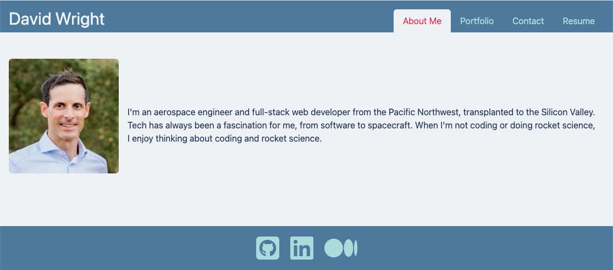
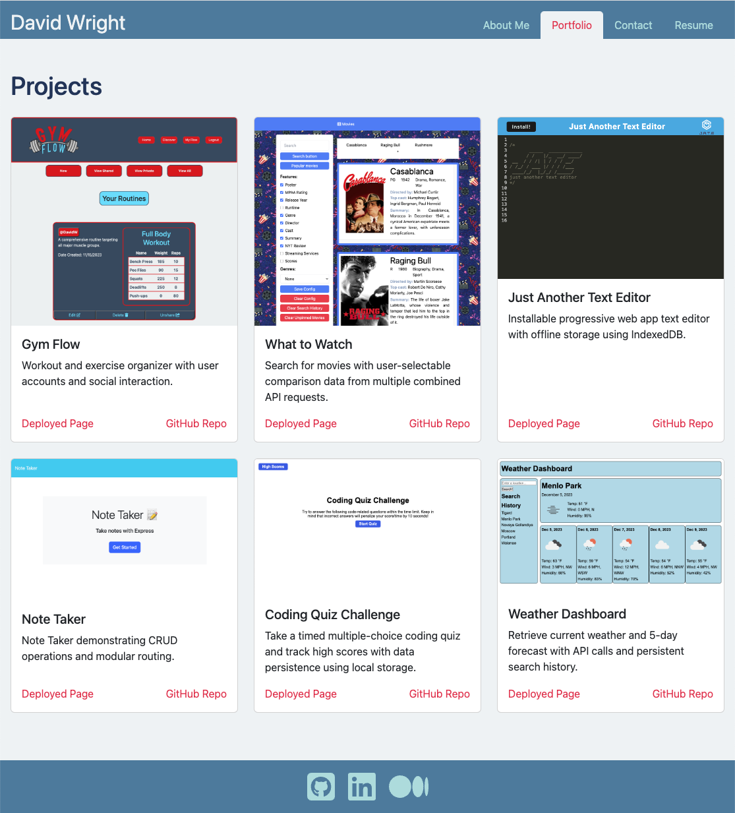
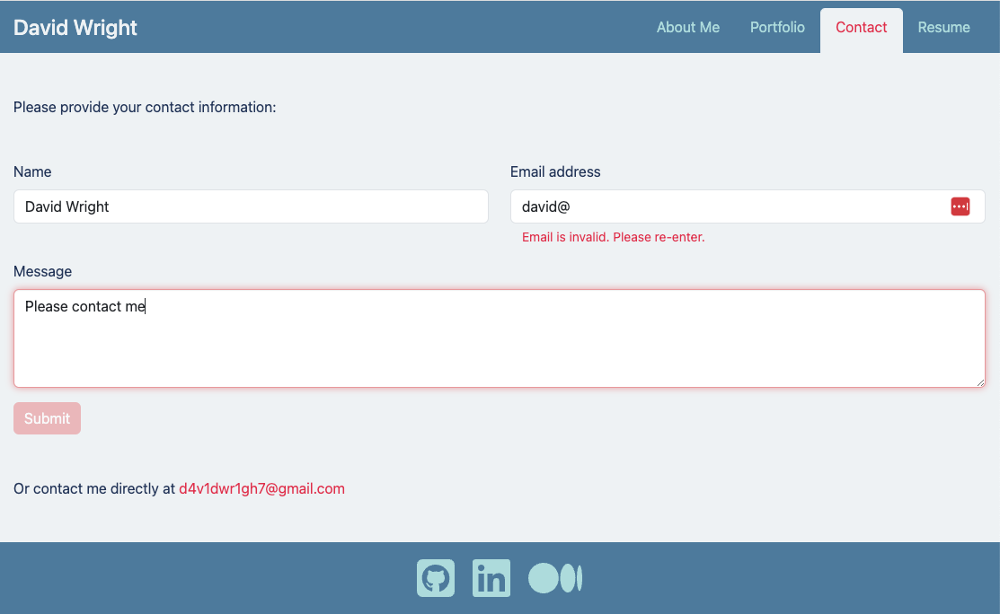
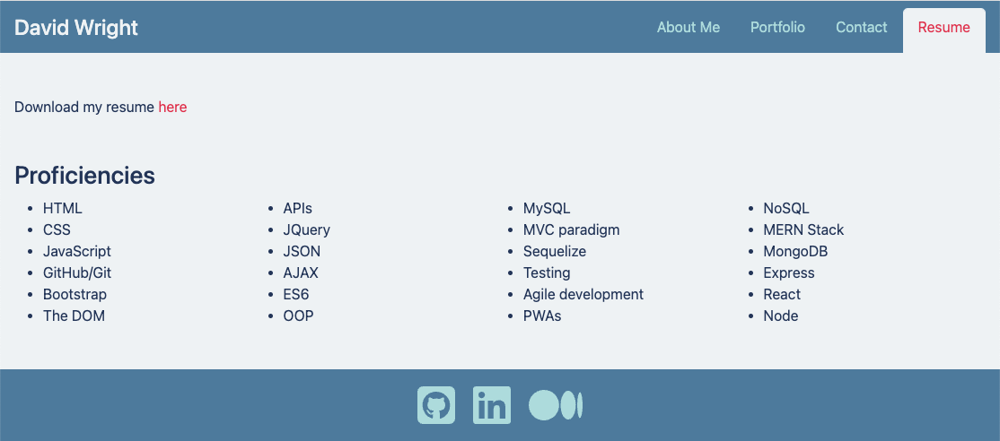

# React Portfolio

## Description 

Your GitHub profile is an extremely important aspect of your public identity as a developer. A well-crafted one allows you to show off your work to other developers as well as potential employers. An important component of your GitHub profile—and one that many new developers often overlook—is the README.md file.

The quality of a README often differentiates a good project from a bad project. A good one takes advantage of the opportunity to explain and showcase what your application does, justify the technologies used, and even talk about some of the challenges you faced and features you hope to implement in the future. A good README helps you stand out among the large crowd of developers putting their work on GitHub.

There's no one right way to structure a good README. There is one very wrong way, however, and that is to not include a README at all or to create a very anemic one. This guide outlines a few best practices. As you progress in your career, you will develop your own ideas about what makes a good README.

At a minimum, your project README needs a title and a short description explaining the what, why, and how. What was your motivation? Why did you build this project? (Note: The answer is not "Because it was a homework assignment.") What problem does it solve? What did you learn? What makes your project stand out? 

This project has been deployed on [Heroku](https://www.heroku.com/) and can be found [here](XXXXXXXXXXXXXXXXXXXXXXXXXXXXX).


## Installation

To install this application locally for development purposes, copy the files and folders from the repo to the desired location. Navigate to the root directory in the command line, and enter the command.
```
npm install
```
To install dependencies. Then enter the command
```
npm run build
```
to bundle and optimize the application using Vite.


## Usage 

The application can be accessed at its deployed location [here](XXXXXXXXXXXXXXXXXXXXXXXXXXXXX).

To run it locally for development purposes, follow the above commands with
```
npm run dev
```

On loading the application, the **About Me** page is displayed.



Clicking on the other links 








## Credits

List your collaborators, if any, with links to their GitHub profiles.

If you used any third-party assets that require attribution, list the creators with links to their primary web presence in this section.

If you followed tutorials, include links to those here as well.


## License

Please refer to the LICENSE in the repo.

---
